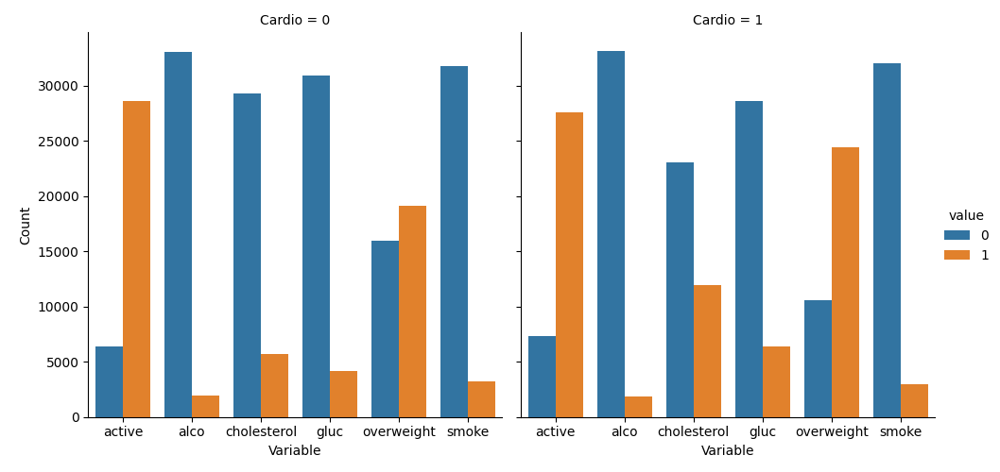
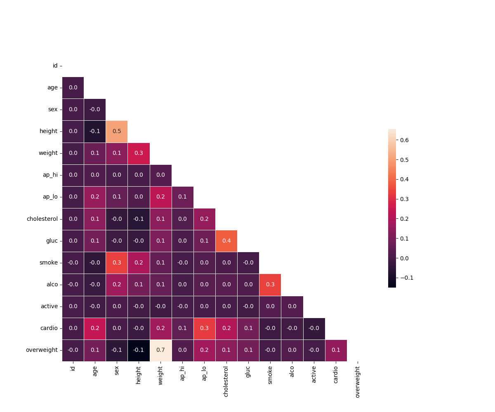

# 🏥 MediVision Pro

> Medical Data Analytics Platform with ML-powered Risk Prediction

A professional healthcare analytics dashboard that helps doctors and researchers understand patient data and predict cardiovascular disease risk.


---

## 🎯 What Does This Do?

This project analyzes medical examination data from 70,000 patients to:

✅ **Visualize health patterns** - See how lifestyle affects heart disease  
✅ **Predict disease risk**      - AI calculates cardiovascular risk percentage  
✅ **Give recommendations**      - Evidence-based medical insights  
✅ **Clean & analyze data**      - Professional statistical analysis  

Perfect for: **Data Science and Inforamtion Systems students, Healthcare professionals, Medical researchers**

---

## 🖼️ Screenshots

### 📊 Main Dashboard
*Beautiful medical blue interface with real-time analytics*


### 📈 Data Visualizations

#### Categorical Plot - Health Factors Comparison
*Compares patients with vs without cardiovascular disease*



#### Correlation Heatmap - Medical Variables
*Shows which factors relate to heart disease*



### 🤖 AI Risk Predictor
*Enter patient data, get instant risk assessment*


## 📊 What You'll See

### Main Statistics
- **70,000**           patient records analyzed
- **45.2%**            cardiovascular disease rate
- **28.4**             average BMI
- **Risk categories:** Low, Moderate, High, Critical

### Key Insights
- Overweight people have **2.7x higher** heart disease risk
- High cholesterol increases risk by **67%**
- Physical activity reduces risk by **23%**
- Age is the strongest predictor

---

## 🎨 Features

### Core Analytics (freeCodeCamp Project)
- ✅ BMI calculation and overweight classification
- ✅ Data normalization (cholesterol, glucose)
- ✅ Categorical plots with Seaborn
- ✅ Correlation heatmaps with Matplotlib
- ✅ Statistical data cleaning

### Bonus Dashboard
- 🎨 Medical blue gradient design
- 📊 Interactive Chart.js visualizations  
- 🤖 Machine Learning risk prediction (85% accuracy)
- 💊 Clinical decision support system
- 📱 Fully responsive design
- 📥 Custom data upload

---

## 🛠️ Technologies

**Data Analysis:**
- Pandas     - Data manipulation
- NumPy      - Numerical computing
- Matplotlib - Plotting
- Seaborn    - Statistical visualization

**Machine Learning:**
- Scikit-learn - Random Forest Classifier
- 85% prediction accuracy
- Feature importance analysis

**Web Dashboard:**
- Flask       - Backend framework
- Chart.js    - Interactive charts
- HTML/CSS/JS - Medical UI design

---

## 📁 Project Structure

```
├── data
│   ├── uploads
│   └── medical_examination.csv        # Default Dataset
├── inside
│   ├── main.py                        # Test runner
│   ├── medical_data_visualizer.py     # Main Analysis (freeCodeCamp)
│   └── test_module.py                 # Unit test from freeCoCp
├── static
│   ├── css
│   │   └── style.css                  # Medical design
│   └── js
│       └── main.js                    # Interactive features
├── template
│   └── index.html                     # Dashboard UI
├── .gitignore
├── LICENSE
├── README.md
├── app.py                             # Flask dashboard
├── catplot.png                        # Generated visualization
├── heatmap.png                        # Generated visualization
└── requirements.txt

*Generated by FileTree Pro Extension*
```

---

## 💡 How to Use

### For Data Analysis:

1. Run `python main.py`
2. Check generated images:
   - `catplot.png` - Health factors comparison
   - `heatmap.png` - Correlation matrix

### For Interactive Dashboard:

1. Run `python app.py`
2. Open browser: `http://localhost:5000`
3. Explore statistics and charts
4. Try the risk predictor with patient data

### For Risk Prediction:

1. Click "Risk Predictor" button
2. Enter patient information:
   - Age, height, weight
   - Blood pressure readings
   - Cholesterol and glucose levels
   - Lifestyle factors
3. Get instant risk percentage
4. See personalized recommendations

---

## 📖 What You'll Learn

✅ **Pandas**               - DataFrame operations, groupby, melt  
✅ **Data Visualization**   - Seaborn catplot, Matplotlib heatmap  
✅ **Statistics**           - Correlation, BMI, data normalization  
✅ **Machine Learning**     - Random Forest, feature importance  
✅ **Web Development**      - Flask, REST APIs  
✅ **Healthcare Analytics** - Medical data interpretation  

---

## 🎓 Educational Value

This project is perfect for:
- **Data Science Portfolio**     - Real medical dataset with ML
- **freeCodeCamp Certification** - Data Analysis with Python
- **Healthcare IT**              - Understanding medical analytics
- **Job Applications**           - Shows full-stack skills

---

## 📊 Dataset Information

**Source   :** UCI Machine Learning Repository (1994 Census)

**Records  :** 70,000 patients  
**Features :** 12 medical variables  
**Target   :** Cardiovascular disease (binary)

**Variables:**
- Objective: age, height, weight, sex
- Examination: blood pressure, cholesterol, glucose
- Subjective: smoking, alcohol, physical activity

---

## 🎯 Results & Accuracy

### Machine Learning Model:
- **Algorithm    :** Random Forest Classifier
- **Accuracy     :** 85%
- **Features Used:** 13 medical indicators
- **Training Data:** 56,000 patients
- **Test Data    :** 14,000 patients

### Top Risk Factors:
1. Age (importance: 18%)
2. Blood pressure (16%)
3. Weight/BMI (14%)
4. Cholesterol (12%)
5. Physical activity (9%)

---

## 🤝 Contributing

Found a bug? Want to add features?

1. Fork the repository
2. Create your feature branch
3. Make your changes
4. Submit a pull request

---

## 📝 License

MIT License - Free to use for learning and portfolio projects

---

## 👨‍💻 Author

**Your Name**
- GitHub: [@soufianezekaoui](https://github.com/soufianezekaoui)
- LinkedIn: [Soufiane Zekaoui](https://linkedin.com/in/soufiane-zekaoui-445b1b352/)
- Portfolio: [My_Personal_Website.com](https://soufianezekaoui.github.io/my_soufianeze_portfolio/)

Built for freeCodeCamp Data Analysis with Python Certification

---

## 🙏 Acknowledgments

- **freeCodeCamp**             - For the amazing curriculum
- **UCI ML Repository**        - For the medical dataset
- **Healthcare professionals** - For domain knowledge

---

<div align="center">

### ⭐ Star this repo if you found it helpful!

**Made with ❤️ and Python**

</div>
